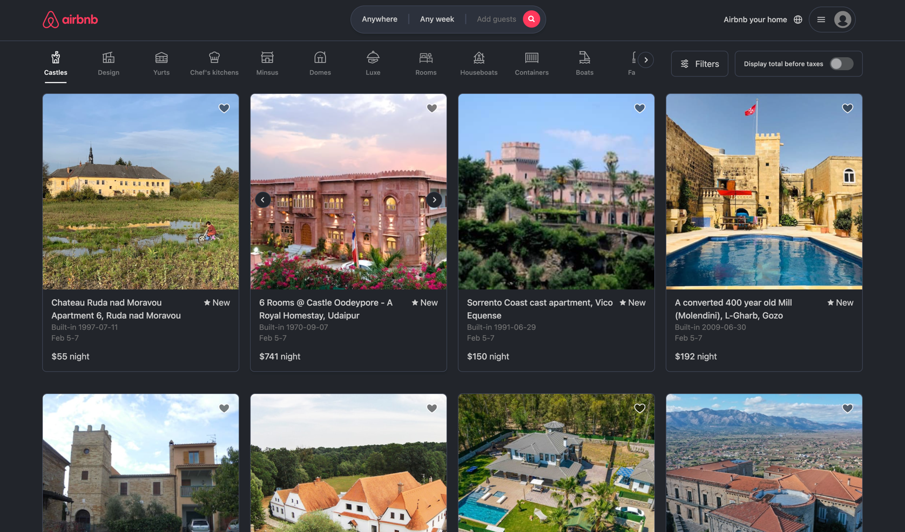

# AirBnB Demo

<h1 align="center">
    
</h1>

  <i align="center">AirBNB Server and Client apps demo 🚀</i>

<h4 align="center">
  
  
  
   
</h4>

    

## Introduction

Our Airbnb Demo App aims to replicate key features of the original Airbnb platform, including property listings, user accounts, booking processes, and feedback mechanisms. By providing a simplified yet functional version of Airbnb, we enable users to understand and interact with the basic elements that contribute to Airbnb's success, from the perspective of both guests and hosts.

This project is the culmination of collaborative efforts within our community, aiming to demystify the complexities behind building a scalable, user-friendly application. Whether you're a budding developer keen on learning web development practices or a seasoned coder looking for inspiration, our demo app provides valuable insights into the development process, challenges, and solutions that come with creating a platform as dynamic as Airbnb.

We encourage you to explore the documentation, delve into the code, and contribute to this evolving project. Together, we can enhance this demo app, making it an exemplary model for educational purposes and beyond.

## Description

## Structure of this repository

`/src` - source codes
- `Training.AirBnb.Clone.Backend` - backend application source code
- `Training.AirBnb.Clone.Frontend` - frontend application source code

`/docs` - project documentations

## Running

### Requirements

- .NET 8
- Vue 3

### Steps

- Install specified SDKs
- Open the project in an IDE
- Run Server App and then run Client App

## Infrastructure

TODO : Feature logos

[Identity](docs/identity/identity.md)

[Notifications API](docs/notifications-api.md)

[Payment API](docs/payment-api.md)

[Media API](docs/media-api.md)

## Business Logic

[Listing registration](docs/listing-registration/listing-registration.md)

## Changelog

Releases

## Contributors

[//]: contributor-faces

[//]: contributor-faces

## You might also like

TODO : WoW 2.0 Contributors rrepo link

## License

This demo is licensed under MIT license and available for free