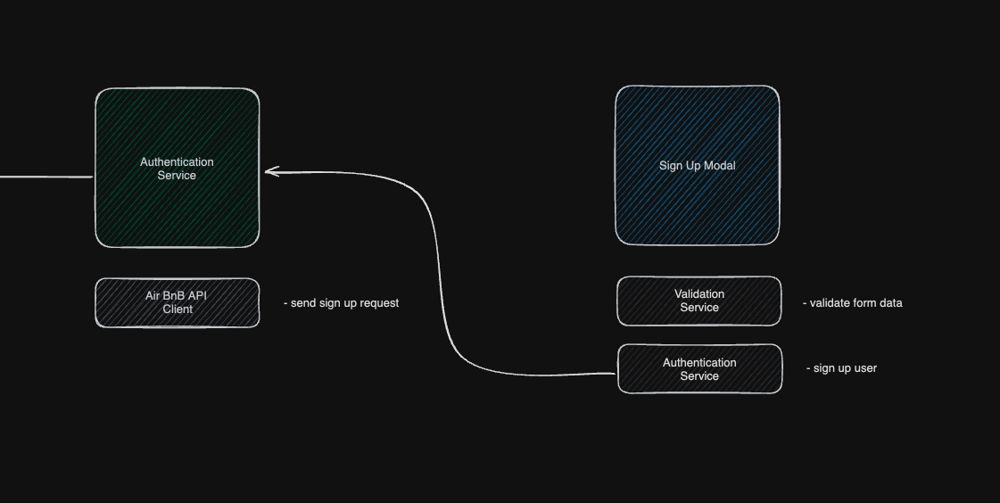
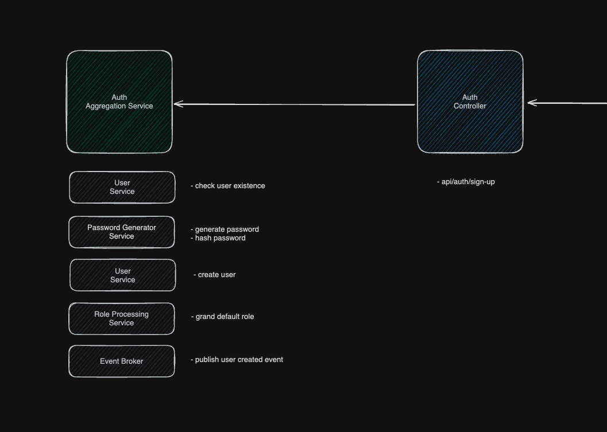
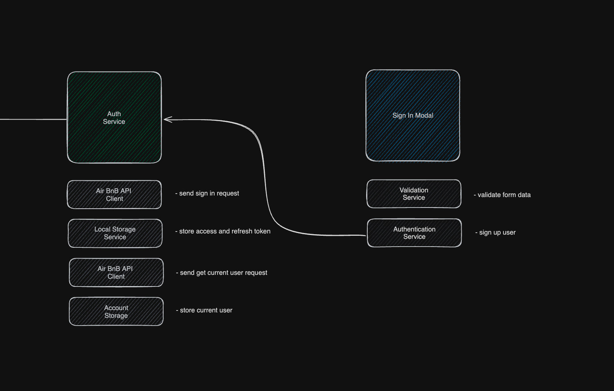
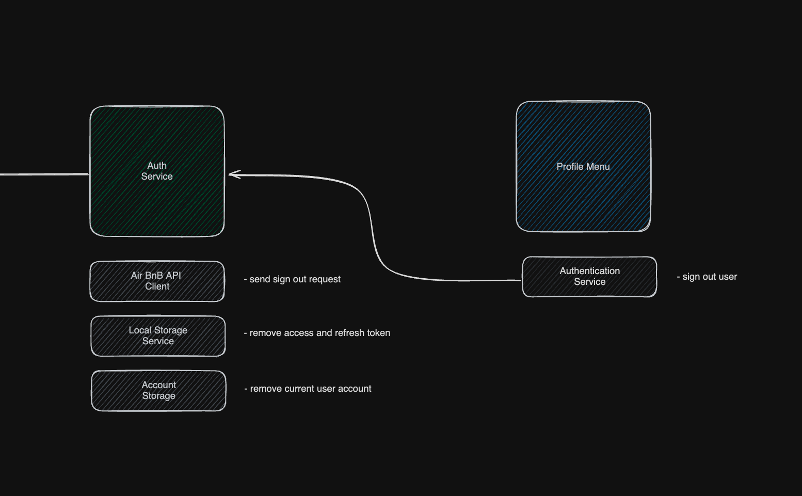

# Identity infrastructure of Air Bnb

## Features content

- [User sign up](#user-creation)

### Sign up

Frontend :

- validate sign up details
- send sign up request

Backend : 

- check user existence
- create user with default roles
- publish user created event

#### Granting / revoking role

<!-- TODO : Add admin grand / revoke role frontend logic -->

- validate permission
- check user and role existence
- create / delete user role

### Sign-in

Frontend :

- validate sign in details
- send sign in request
- store access and refresh tokens and account

Backend : 

- validate user existence
- generate access and refresh token

#### Sign-out

Frontend : 

- send sign out request
- remove access and refresh token along with account

Backend :

- validate access token
- remove access and refresh token

#### Access token generation

#### Refresh access token

#### User verification

#### Account lock and unlock

#### Password reset, Password change, Password expiration and Password rotate

#### Entities relationship

